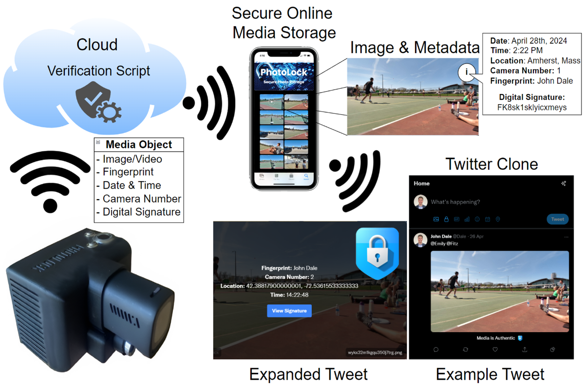

# PhotoLock Project

## Overview

The PhotoLock project provides a robust solution for authenticating and verifying the integrity of images and videos. In an era where digital media can easily be manipulated through sophisticated tools and AI, our system offers a scalable infrastructure for capturing, uploading, and verifying authentic media. This project ensures that media can be tied back to specific users and devices, providing a trustworthy source for news, social media, and other platforms that rely on digital content.

## Checkout the Twitter Clone repo which integrates with PhotoLock below:
https://github.com/JohnDale02/twitter-clone

## Checkout the PhotoLock Personal video and image storage website below:
https://github.com/JohnDale02/Photo-Authentication-App 

## Watch our demo video below to see PhotoLock in action:
[Watch the demo video on YouTube](https://www.youtube.com/watch?v=JTpTnfJgP68)

## Key Features

- **Hardware Root of Trust:** Utilizes a Trusted Platform Module (TPM) to securely sign media captured by the device.
- **Media Authentication:** Verifies the authenticity of images and videos using digital signatures, preventing tampering or unauthorized modifications.
- **Automatic Wireless Upload:** Media is automatically uploaded to the cloud when Wi-Fi is available, with local storage on an SD card as a fallback.
- **Open Source:** Transparent implementation with all source code available for review and modification.
- **Metadata Integration:** Captures and embeds location and time metadata into each media file.
- **Scalable Infrastructure:** Supports multiple cameras and users, making it suitable for a wide range of applications.

Checkout the DOCUMENTATION.md file for information on repo strucuture.

### Key Components

- **Embedded Software:** 
  - Manages media capture, metadata collection, and secure signing using a TPM.
  - Written in Python, running on a Raspberry Pi 4 with a custom PCB.
  
- **Cloud Software:** 
  - AWS-based infrastructure for verifying and storing media.
  - Integrates with an SQL database for public key retrieval and metadata storage.
  
- **Custom Hardware:**
  - Includes a Raspberry Pi 4, TPM, GPS module, and fingerprint sensor.
  - Designed for secure and reliable operation, with a focus on media authenticity.

## License

This project is licensed under the MIT License - see the LICENSE file for details.
